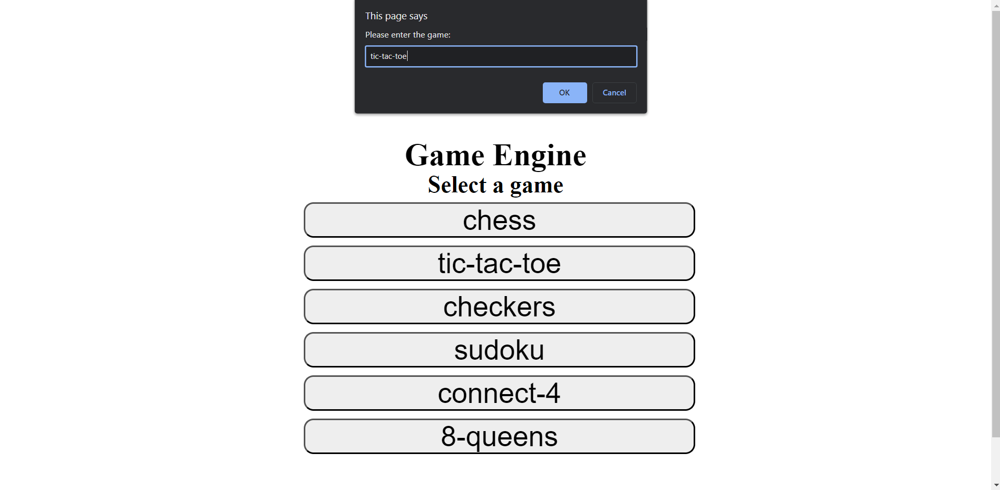
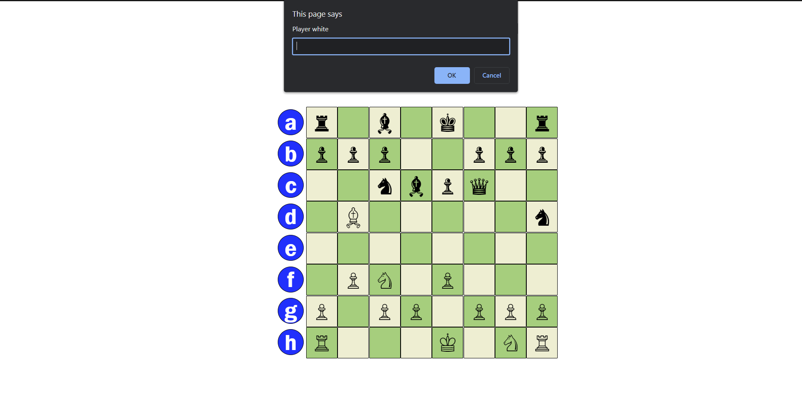
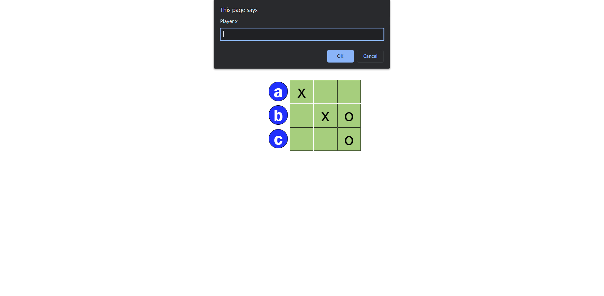
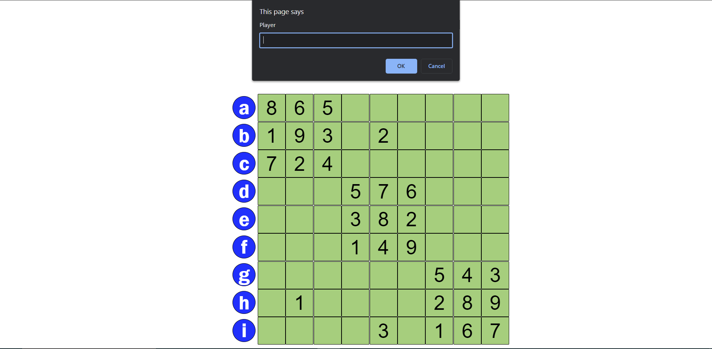
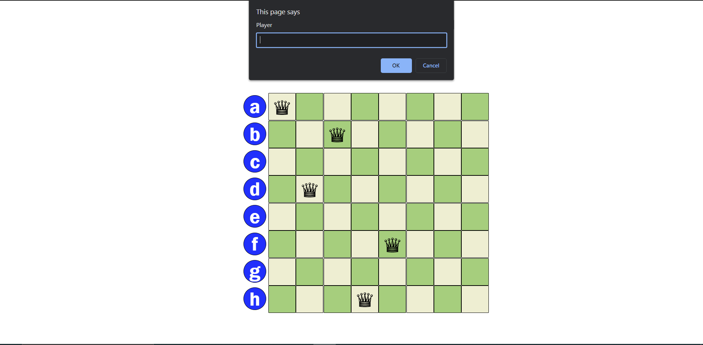
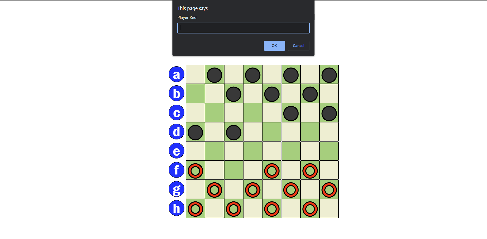
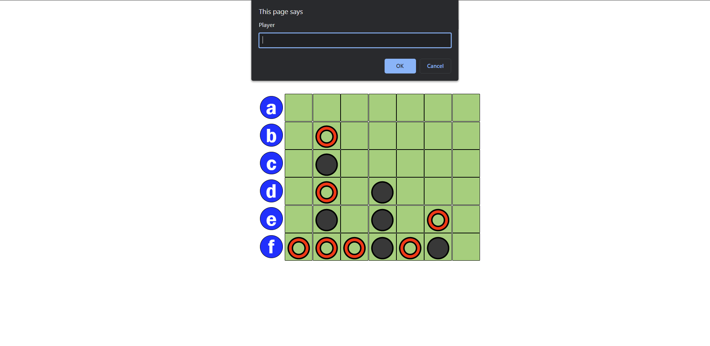

# GameEngine
A generic game engine for drawing game boards 2 times (one using JavaScript and the other using Scala). The engine will support drawing six games: Tic-Tac-Toe, Connect-4, Checkers, Chess, Sudoku and 8-Queens.
# Contributors
- [Moaz AbdulFattah](https://www.github.com/Moaz2025)
- [Hassan Ahmed](https://www.github.com/hassanAhmed310)
# Input
## Home Page:
Input the name of the game from the games list (ex: "8-queens")
if not right do not worry, you will told to try again :).
## Input in a game:
To input a location: type the row (as a character) followed by the number of the column.
ex: to input the top right corner location type "a1".
### Chess
First location then a space then destination (ex: "b1 c1").
### Connect-4
Column (ex: "3").
### Sudodu
Location then a space then a number (ex: "b1 3").
### 8-Queens
Location(ex: "c1").
### Tic Tac Toe
Location(ex: "c1").
### Checkers
First location then a space then destination (ex: "b1 c2").
# UI ScreenShots
## Home Page

## Chess

## Tic Tac Toe

## Sudoku

## 8 Queens

## Checkers

## Connect 4

